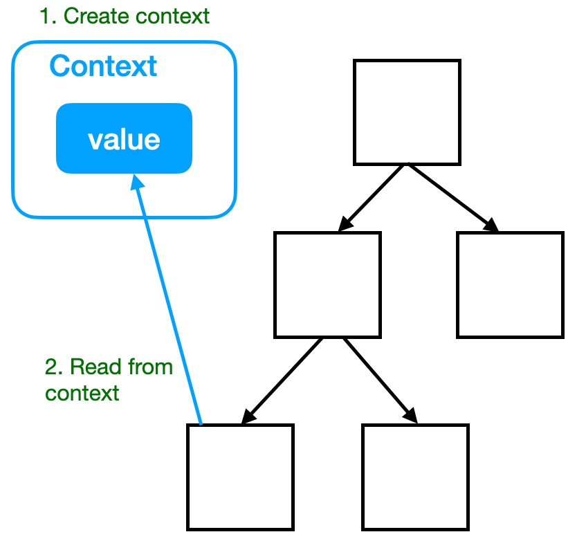
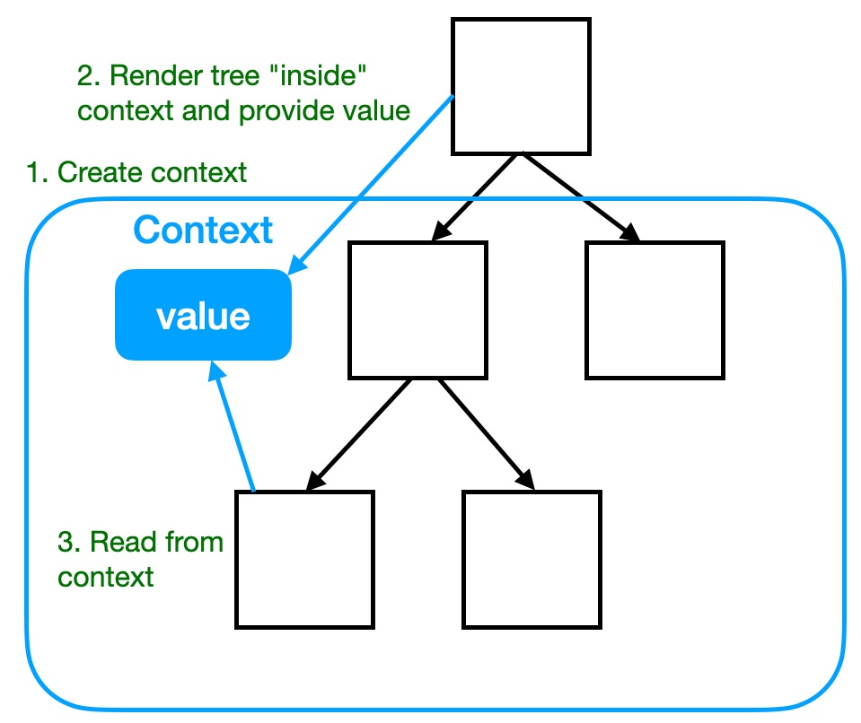

## React Context

### Context

- Basically means "global React state"
- Makes it easy to share state to any part of the tree
- Avoids "prop drilling" problem

```js
<Page user={user} avatarSize={avatarSize} />
// ... which renders ...
<PageLayout user={user} avatarSize={avatarSize} />
// ... which renders ...
<NavigationBar user={user} avatarSize={avatarSize} />
// ... which renders ...
<Link href={user.permalink}>
  <Avatar user={user} size={avatarSize} />
</Link>
```

### Creating Context

- Context is like a namespace or box where you can store some data
- You **create context** in one place, **read** it elsewhere



### Create Context

- Context is an object that can be exported
- Provide the value to be stored in the context
- 

```js
// create context object
export const ThemeContext = React.createContext('light')
```

### Create Context

- Gotcha: **Do not** create the context inside a React component

```javascript
// yes
export const ThemeContext = React.createContext('light')

// no
const App = () => {
  const ThemeContext = React.createContext('light')
  return /* ... */
}
```

### Reading Context

- Read from context with `useContext` hook
- Pass in the context object!

```javascript
import { ThemeContext } from './somewhereElse.js'

// somewhere in your app...
const Toolbar = () => {
  const theme = useContext(ThemeContext)
  console.log(theme) // 'light'
}
```

### Context Values

- This uses the **default value** passed in when you created the context
- It can be any value: a string, array, object, etc.

```js
const ThemeContext = React.createContext({
  primary: '#000000',
  seconary: '#eeeeee',
})

// somewhere in your app...
const Toolbar = () => {
  const { primary, secondary } = useContext(ThemeContext)
}
```

### Context

- Context created in this way is **read-only**.
- Once you've created the context, it's not going to change
- Making context dynamic requires an extra step: a `Provider`

### Dynamic Context

1. Create context
1. Set value and render tree
1. Read from context



### Step 1: Create Context

- Just like before...

```js
export const ThemeContext = React.createContext('light')
```

- You can still give it a default value if you want

### Step 2: Set value and render tree

- Context has a `Provider`
- `Provider` creates a box with some data you give it. 
- You render the React tree inside it

```js
const ThemeContext = React.createContext()

const App = () => {
  return (
    <ThemeContext.Provider value="dark">
      {/* ... */}
    </ThemeContext.Provider>
  )
}
```

### Step 3: Read from context

- Read from context object with `useContext`

```js
// assuming Toolbar is rendered by App
const Toolbar = () => {
  const theme = useContext(ThemeContext)
  console.log(theme) // 'dark'
  return (<p>{theme}</p>)
}
```

### Step 3: Old school

- Context has a `Consumer`
- Its usage was awkward (render props)
- For reference, here's the old way without hooks:

```js
const Toolbar = () => {
  return (
    <ThemeContext.Consumer>
      {(theme) => {
        console.log(theme) // 'dark'
        return (<p>{theme}</p>)
      }}
    </ThemeContext.Consumer>
  )
}
```

UGH.

### Changing Context

- You're setting the context value via the `Provider` inside a React component
- You can tie that value to some state!

```javascript
const App = () => {
  const [theme, setTheme] = useState('light')
  const toggleTheme = () => {
    setTheme(theme === 'light' ? 'dark' : 'light')
  }
  const themeState = { theme, toggleTheme }
  return (
    <ThemeContext.Provider value={themeState}>
      {/* ... */}
    </ThemeContext.Provider>
  )
}
```

### Changing Context from Nested Component

- Now use the provided callback elsewhere

```javascript
const Toolbar = () => {
  const { theme, toggleTheme } = useContext(ThemeContext)
  return (
    <button onClick={toggleTheme}>Toggle theme</button>
  )
}
```
